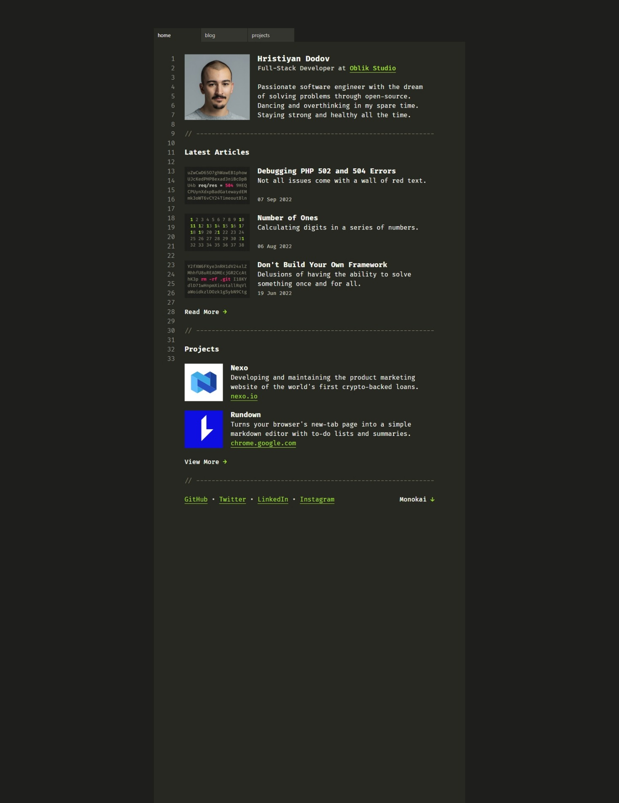

#Dodov.dev-Recreate

# Dodov.dev Recreate
We basically recreated the dodov.dev portfolio website, as it is very dynamic and non-conventional website.
Below is a screenshot of the site:

## Table of Contents

- [About](#about)
- [Contributions guidelines](#contributions guidelines)
- [Built with](#built with)
- [Resources](#resources)
- [Contributors](#contributing)
- [Live site](#livesite)

## About
We tried our hands on recreating this site because it seemed intriguing and quite challenging, It is the portfolio site of Hristiyan Dodov, A dynamic Full Stack Developer at Oblik Studio.

## Contributions guidelines

* Follow these steps to begin your contribution
* Fork this repository
* Clone the repository to your local machine using
* git clone https://github.com/GiftCode27/Dodov.dev-Recreate.git
* Open cloned repository in your code editor
* Find or create new file with the name of the page you're assigned to
* Add your code/make your changes
* Commit with a descriptive message and push
* Create a pull request

## Built with
HTML5  CSS3  JavaScript

###Code editor
VSCode

##Resources
* [W3schools](https://www.w3schools.com/howto/howto_js_toggle_dark_mode.asp)
* [W3schools](https://www.w3schools.com/CSS/css_counters.asp)

## Contributors

|Name|Github Username|
|-------|---------------|
|Gift Charles| GiftCode27 |
|Haleemah Korodo| Haleemah_Abosede|
|Richmond Esosa| mhiztarich|
|Gloria Okeke|GloriaOkeke|
|Imabong James| imabee|
|Precious Aigbiremhon| Tech8468|

##Live Site
